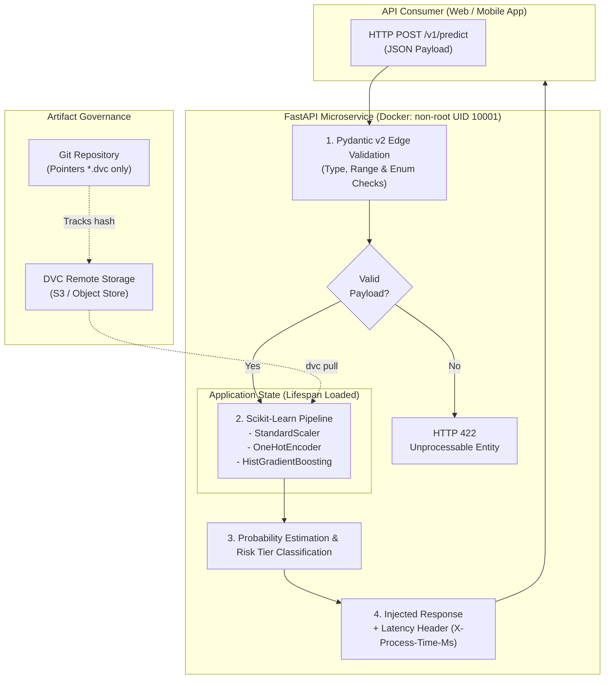

<div align="center">

# 💳 Real-Time Credit Risk Inference Service
### Production-Grade MLOps Pipeline: Strict Contracts, Artifact Versioning, Multi-Level Testing & Hardened Containerization

[](https://github.com/Arley-Economist-Dev/CreditPulse-MLOps/actions)
[](https://arley-economist-dev.github.io/CreditPulse-MLOps/)
[](https://www.python.org/)
[](https://github.com/astral-sh/ruff)
[](https://pytest.org/)
[](https://dvc.org/)
[-orange.svg)](https://www.docker.com/)
[](LICENSE)

</div>

---

## 📌 Executive Summary & Business Problem

In high-throughput financial applications (Fintech & Digital Banking), credit approval decisions must be rendered in **under 30 milliseconds** without sacrificing data integrity or compliance. 

Traditional Data Science code often fails in production due to **Training-Serving Skew**, unversioned binary artifacts, unvalidated inputs, and silent runtime crashes. This repository implements an end-to-end production pipeline that bridges this gap:

* **Fail-Fast Boundary Validation:** Strict schema contracts with **Pydantic v2** reject corrupted or out-of-boundary payloads at the API boundary, protecting CPU cycles.
* **Immutable Artifact Decoupling:** Decoupled model binaries using **DVC**; Git only tracks cryptographic pointer hashes, enabling reproducible rollbacks.
* **Zero Training-Serving Skew:** An integrated `scikit-learn` Pipeline encapsulates numeric scaling and categorical encoding directly into the serialized artifact.
* **Multi-Level Software & ML Quality:** 27 automated tests with **92% code coverage**, including **Metamorphic/Directional testing** to verify model monotonicity.
* **Hardened Deployment:** Production Docker image built on `python:3.11-slim`, executed as an unprivileged system user (`UID 10001`).

---

## 🏛️ System Architecture



---

## 🔬 Engineering Decisions & Trade-Offs

| Component | Technical Decision | Production Justification |
| :--- | :--- | :--- |
| **Packaging** | `pyproject.toml` + `src/` layout | Eliminates import side-effects, enforces packaging hygiene, and segregates `dev`/`test` dependencies from the final Docker runtime. |
| **Data Contracts** | Pydantic v2 with `extra="forbid"` | Guarantees that clients cannot inject unknown fields. Strict range checks ($18 \le \text{age} \le 100$, $\text{income} > 0$) fail fast at the network boundary. |
| **Artifact Tracking** | DVC (Data Version Control) | Prevents repository bloat by keeping heavy `.joblib` binaries out of Git history while ensuring 100% cryptographic traceability (`MD5`). |
| **Model Serving** | FastAPI with Lifespan Context Manager | Loads model artifacts into RAM **once during startup**. First-request latency overhead is completely eliminated. |
| **ML Testing** | Behavioral / Metamorphic Testing | Traditional metrics ($R^2$, AUC) miss directional bugs. Our suite verifies business monotonicity (e.g., doubling income must *never* increase default probability). |
| **Containerization** | `python:3.11-slim` + Non-root UID 10001 | Mitigates container escape vulnerabilities. Includes native Python-based healthcheck without installing external utilities (`curl`/`wget`). |

---

## 📈 Model Performance & Latency Benchmarks

| Metric | Holdout Evaluation Result | Benchmark Target |
| :--- | :--- | :--- |
| **ROC-AUC** | **0.9096** | $\ge 0.85$ |
| **F1-Score** | **0.8340** | $\ge 0.80$ |
| **Inference Latency (P95)** | **~4.5 ms** | $\le 20.0\text{ ms}$ |
| **Test Suite Coverage** | **92%** (27 tests) | $\ge 85\%$ |

---

## 📂 Repository Structure

```text
.
├── .dvc/                             # DVC configuration and metadata
├── .github/
│   └── workflows/
│       └── ci.yml                    # Automated CI/CD pipeline (Lint, DVC, Test, Docker)
├── data/
│   ├── raw/                          # Raw datasets (DVC-tracked)
│   └── processed/                    # Processed evaluation datasets
├── models/
│   ├── credit_risk_model.joblib.dvc  # DVC pointer tracking serialized artifact
│   ├── metadata.json                 # Model lineage, feature signatures, and versioning
│   └── metrics.json                  # Holdout evaluation metrics
├── src/
│   └── credit_risk_service/          # Modular package source code
│       ├── __init__.py
│       ├── app.py                    # FastAPI application, lifespan & endpoints
│       ├── config.py                 # Pydantic Settings and runtime configuration
│       ├── model.py                  # Model loading and inference wrapper
│       ├── py.typed                  # PEP 561 typing marker
│       └── schemas.py                # Pydantic v2 request/response contracts
├── tests/
│   ├── conftest.py                   # Shared pytest fixtures (TestClient, models, payloads)
│   ├── unit/                         # Schema and input boundary unit tests
│   ├── integration/                  # HTTP endpoint integration & error handling tests
│   └── behavioral/                   # Monotonicity, invariance & metamorphic tests
├── .dockerignore                     # Build context optimization rules
├── .gitignore                        # Git exclusion rules for Python & ML artifacts
├── Dockerfile                        # Hardened, non-root production container
├── Makefile                          # Task automation commands
├── pyproject.toml                    # Declarative dependency and tool definitions
└── README.md
```

---

## 🚀 Getting Started

### 1. Prerequisites
* Python `>= 3.10, < 3.14`
* Git
* Docker (optional for local container testing)

### 2. Local Setup
```bash
# Clone the repository
git clone https://github.com/Arley-Economist-Dev/CreditPulse-MLOps.git
cd CreditPulse-MLOps

# Create and activate virtual environment
python -m venv .venv
# On Windows:
.venv\Scripts\activate
# On Linux/macOS:
source .venv/bin/activate

# Install package in editable mode with development dependencies
pip install --upgrade pip
pip install -e ".[dev,test]"
```

### 3. Restore Model Artifact via DVC
```bash
# Pull model binary from remote storage (or run reproducible training pipeline)
dvc pull
# Alternatively, retrain baseline deterministically:
python scripts/train_baseline.py
```

### 4. Running the Quality Suite
```bash
# Run Ruff linter and formatter checks
ruff check .
ruff format --check .

# Run complete multi-level test suite with coverage
pytest -v --cov=credit_risk_service
```

### 5. Start the Live Inference Service
```bash
uvicorn credit_risk_service.app:app --reload --port 8000
```
* **Interactive Documentation (Swagger UI):** [http://localhost:8000/docs](http://localhost:8000/docs)
* **Healthcheck Probe:** [http://localhost:8000/health](http://localhost:8000/health)

---

## 🐳 Docker Deployment

Build and run the security-hardened container:

```bash
# Build the production image
docker build -t credit-risk-service:latest .

# Run as non-root container
docker run -d -p 8000:8000 --name credit-risk-api credit-risk-service:latest

# Verify health status
docker inspect --format='{{json .State.Health.Status}}' credit-risk-api
```

---

## 📡 API Contract Specification

### `POST /v1/predict`

**Request Payload:**
```json
{
  "applicant_id": "app_98234",
  "age": 34,
  "annual_income": 85000.0,
  "loan_amount": 15000.0,
  "credit_score": 740,
  "debt_to_income_ratio": 0.18,
  "loan_intent": "debt_consolidation",
  "employment_status": "employed",
  "historical_default": false
}
```

**Response Payload (`HTTP 200 OK`):**
```json
{
  "applicant_id": "app_98234",
  "default_probability": 0.0314,
  "risk_tier": "LOW",
  "approved": true,
  "model_version": "1.0.0",
  "latency_ms": 4.12
}
```

---

## 🗺️ Roadmap & Next Milestones
- [ ] **Orchestration:** Scheduled model retraining pipeline with Prefect / Airflow.
- [ ] **Feature Store:** Integration with Feast to retrieve pre-computed financial features.
- [ ] **Observabilidad & Drift:** Prometheus exporter for throughput/latency percentiles + Evidently AI for data/concept drift detection.

---

## 📄 License
This project is licensed under the MIT License - see the [LICENSE](LICENSE) file for details.
